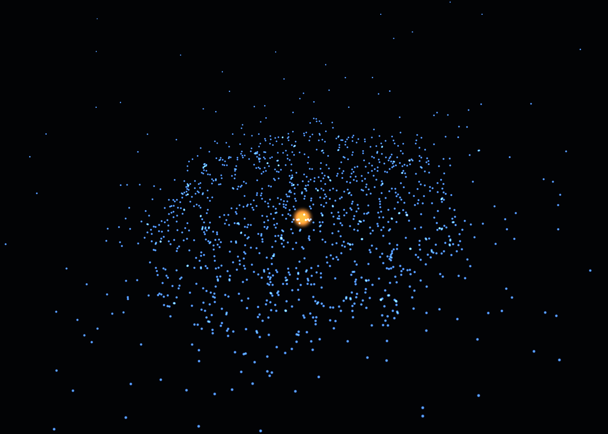

# 2D N-Body Gravitational Simulator

A 2D N-body physics simulator with real-time OpenGL rendering. It simulates gravitational interactions between celestial bodies using numerical integration and renders them with additive glow effects.

## Functionality

### Physics Engine
- **N-Body Gravitational Simulation**: Newtonian gravity with Plummer softening to avoid singularities.
- **Force Fields**:
  - `GravityForce`: Standard gravitational attraction.
  - `LennardJonesForce`: Short-range repulsion/attraction.
  - `CompositeField`: Combines multiple force fields.
- **Integrators**:
  - `EulerIntegrator`: First-order explicit Euler.
  - `VerletIntegrator`: Second-order velocity Verlet (symplectic, energy-conserving).

### Pre-built Scenarios
1. **Binary Star**: Two equal-mass stars in circular orbit.
2. **Cold Collapse**: 400 particles collapsing under gravity.
3. **Galaxy**: 1500 particles orbiting a central massive core.

## How to Use

### Prerequisites
- C++23 compatible compiler (GCC 13+, Clang 16+, MSVC 19.35+)
- CMake 3.20+
- OpenGL 3.3 core profile GPU
- Internet connection (for fetching GLFW and GLM via CMake FetchContent)

### Building
1. **Clone the repository**:
   ```bash
   git clone <repository-url>
   cd kralica
   ```
2. **Set up GLAD** (if not already present):
   - Place GLAD files in `libs/glad/` (either `glad.h`/`glad.c` for GLAD 1 or `gl.h` for GLAD 2).
   - Ensure `libs/KHR/khrplatform.h` exists.
3. **Build with CMake**:
   ```bash
   mkdir build && cd build
   cmake ..
   cmake --build . --config Release
   ```
4. **Run**:
   ```bash
   ./kralica
   ```

### Configuration
Physics constants can be modified in `constants.h`:
```cpp
constexpr const double G = 6.67430e-3;      // Gravitational constant (scaled)
constexpr const double R_SOFT_GRAV = 1e-6;  // Gravity softening length
constexpr const double EPSILON_LJ = 1.00;   // Lennard-Jones well depth
constexpr const double SIGMA_LJ = 1.00;     // Lennard-Jones zero-crossing distance
```

## Fotos


## AI Contribution

This project was developed with significant assistance from AI language models. The AI contributed to:

- **Code Generation**: openGL and CMake
- **Documentation**: Inline comments and this README

Everything else is made by me.